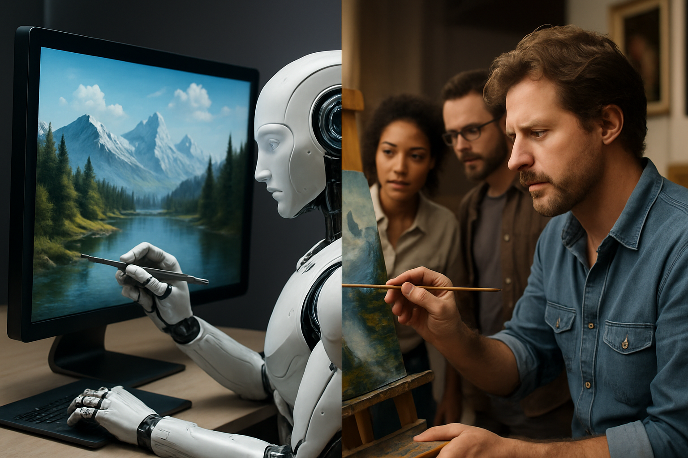
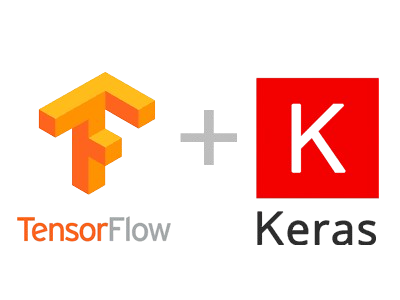

# Image-Detector

## Descripcion
La inteligencia artificial a incrementado sus capacidades para la generacion de imagenes a tal punto en el que algunas parecen reales 
Este repoditorio contiene una pagina web donde subes la imagen y con un modelo convolucional con keras clasifica la imagen como hecha por IA o por humanos.

## Que contiene este proyecto?

- **🖥️Front-end:**

Front-end creado con streamlit en donde se cargara la imagen que deseas clasificar dando como resultado dos posibles opciones
'La imagen fue hecha por humanos' o 'La imagen fue hecha por inteligencia artificial'

- **⚙️⛏️ Back-end:**

Dentro de la carpeta /model se encuntran las clases que componen el back:
 - api.py : Es el api creada con fastapi para llamar al modelo
 - Modelo.py : Clase encargada de hacer la prediccion cargado un archivo con los mejores pesos
 - Scale.py : Clase encargada de re-escalar las imagenes para la prediccion

 ## Tecnologias 🔬

 - **Python**
 

  

- **TensorFLow - Keras**
 

  

- **Streamlit**
 

  

